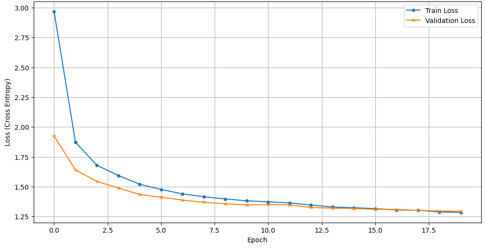
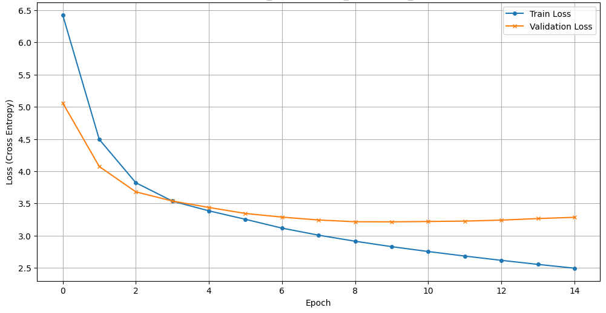

# Attention Is All You Build: Production-Ready Transformer from Scratch


A comprehensive, "from-scratch" implementation of the Transformer architecture (Encoder-Decoder) for Neural Machine Translation (English-Vietnamese).

This project goes beyond simple implementation; it focuses on **engineering best practices**, **modern architecture optimizations** (Pre-LN), and **integration with the Hugging Face ecosystem**.

Unlike typical tutorials, this repository demonstrates how to build a **production-ready training pipeline** capable of handling large-scale datasets (12M+ sentence pairs) with dynamic batching and robust experiment tracking.

---

## 🚀 Key Features

### 1. Architecture & Engineering

* **Pure PyTorch Implementation**: Built the entire Transformer architecture (Encoder-Decoder) from the ground up, including `MultiHeadAttention`, `PositionalEncoding`, and `FeedForward` blocks without relying on `nn.Transformer`.
* **Modern Best Practices**:
  * **Pre-Layer Normalization (Pre-LN)**: Implemented for better gradient flow and training stability compared to the original Post-LN.
    * **Weight Tying**: Shared weights between the Input Embeddings and the Output Projection (Generator) to reduce model size (~27M params).

### 2. Robust Training Strategy

* **Optimization**: Utilized `AdamW` optimizer combined with a **Linear Scheduler with Warmup** (`get_linear_schedule_with_warmup`) to manage learning rate dynamics effectively during the initial training phase.
* **Resource Efficiency**: Implemented a custom **EarlyStopping** class to monitor validation loss, preventing overfitting and optimizing GPU usage.
* **Loss Calculation**: Utilized **Label Smoothing** in the Cross-Entropy Loss to improve model generalization.

### 3. Production-Ready Data Pipeline

* **Custom BPE Tokenizer**: Trained a Byte-Pair Encoding tokenizer specifically for the English-Vietnamese corpus (32k vocabulary) using the Hugging Face `tokenizers` library.
* **Dynamic Padding**: Implemented a custom `DataCollator` to dynamically pad batches to the longest sequence in the batch (not the max model length), significantly reducing VRAM usage and computation time.
* **Efficient Loading**: Designed a lazy-loading `Dataset` class to handle large-scale datasets (12M+) without memory overflow.

### 4. Ecosystem Integration

* **Experiment Tracking**: Integrated **Weights & Biases (WandB)** for real-time logging of loss curves, learning rates, and translation examples.

---

## 📊 Experiments & Results

### 1. Dataset Overview

This project evaluates the model on two different scales of English-Vietnamese data to test both model generalization and pipeline robustness:

* **[CCMatrix](https://opus.nlpl.eu/CCMatrix/en&vi/v1/CCMatrix) (Scale Stress-Test):** A subset of **1M pairs** filtered from the massive 12M+ corpus. This was used primarily to test the pipeline's capability to handle large-scale data ingestion and dynamic batching.
* **[IWSLT'15](https://huggingface.co/datasets/IWSLT/mt_eng_vietnamese) (Standard Benchmark):** ~133k sentence pairs. A high-quality, pre-split dataset used for reliable benchmarking.

### 2. Quantitative Results

Evaluation was performed using **SacreBLEU** (the research standard) and standard BLEU to ensure reproducibility.

| Dataset | Split | BLEU | SacreBLEU | Notes |
| :--- | :--- | :--- | :--- | :--- |
| **CCMatrix** | Test* | 49.53 | -- | *See limitation note below. |
| **IWSLT'15** | Test | 24.87 | **28.91** | **Best Result.** Trained with Label Smoothing (0.1). |

> **Note on CCMatrix Score:** The high score (49.53) on the CCMatrix subset serves as a pipeline validation rather than a translation benchmark. Since the subset was created by selecting the highest-quality pairs from a larger corpus and then splitting, the Train/Test distributions likely have significant overlap.

### 3. Impact of Optimizations

* **Label Smoothing:** Applying `label_smoothing=0.1` on the IWSLT dataset resulted in slightly higher Training/Validation Loss (due to higher entropy targets) but **improved the final SacreBLEU score**. This confirms that the model learned to generalize better rather than becoming overconfident.
* **Scheduler & Early Stopping:** The use of a Linear Scheduler with Warmup and Early Stopping prevented overfitting, allowing the model to converge optimally without wasting GPU resources.

### 4. Visualizations

#### Training Loss (CCMatrix Subset)



#### Training Loss (IWSLT'15)



**[Link to Full WandB Dashboard](https://wandb.ai/alaindelong-hcmut/Demo/workspace?nw=nwuseralaindelong)**

---

## Project Structure

```markdown
📂 Attention-Is-All-You-Build
├── artifacts/
│   ├── checkpoints/
│   │   └── transformer_en_vi_iwslt_1.safetensors
│   ├── models/
│   │   └── transformer_en_vi_iwslt_kaggle_1.safetensors
│   └── tokenizers/
│       ├── iwslt_en-vi_tokenizer_16k.json
│       └── iwslt_en-vi_tokenizer_32k.json
├── data/
│   ├── IWSLT-15-en-vi/
│       ├── train/
│       ├── test/
│       └── validation/
│   
├── src/
│   ├── __init__.py
│   ├── callbacks.py
│   ├── dataset.py
│   ├── embedding.py
│   ├── engine.py
│   ├── layers.py
│   ├── model.py
│   ├── modules.py
│   ├── tokenizer.py
│   ├── utils.py
│        
├── config.py
├── inference.py
├── train.py
├── README.md
└── LICENSE
```

---

## Design Decisions

* **Pre-Layer Normalization (Pre-LN)**:
    Unlike the original "Attention Is All You Need" paper (which used Post-LN), this implementation places LayerNorm *before* the sub-layers (Attention/FFN). This creates a "clean path" for gradients during backpropagation, preventing the vanishing gradient problem in deep networks and removing the need for a warm-up stage in some configurations.

* **Weight Tying**:
    The weights of the **Target Embeddings** and the **Generator** (Output Projection) are tied. Since both layers map between the same latent space size ($d_{model}$) and the vocabulary size, sharing weights acts as a regularizer and significantly reduces the model size (saving parameters equivalent to $d_{model} \times V$).

* **Dynamic Padding**:
    Instead of padding all sentences to a fixed global maximum length (e.g., 150), the custom `DataCollator` pads batches to the length of the *longest sequence in that specific batch*. This drastically reduces wasted computation on padding tokens and optimizes VRAM usage.

---
